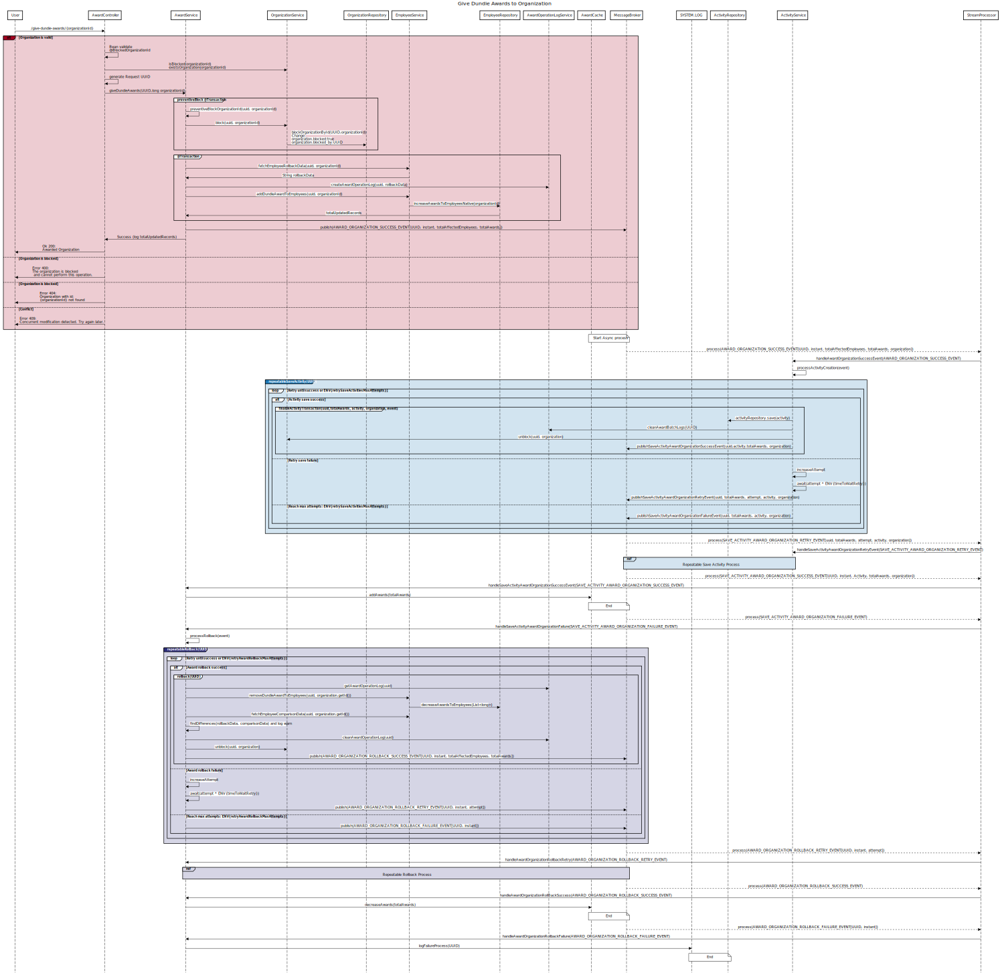

## Employee directory organization

This is an application for managing employees of a company. Employees belong to organizations within the company.

As recognition, employees can receive Dundie Awards.

* A `Dundie Award` is in reference to the TV show [The Office](https://en.wikipedia.org/wiki/The_Dundies) in which the main character hands out awards to his colleagues. For our purposes, it's a generic award.

## Instructions

In preparation for the upcoming call with NinjaOne, `clone` this repo and run it locally. If everything runs successfully, you will see the following page in your browser.


Become familiar with the application and it's characteristics. Use your favorite HTTP Client (like [Postman](https://www.postman.com/)) to exercise the endpoints and step through the code to help you get to know the application. 

In the call, we will introduce new code to the application, and you will comment on issues with the endpoint. Please be ready to share your screen in the call with us with the application ready to run. 

**Bonus:** Spot any issues or potential improvements you notice in the application while you're familiarizing yourself and make note of them for our call. We would love to see your input in how to make this application better.

## Give Dundie Awards to Organization


### Features

**Implement the Endpoint**  
Create the endpoint "/give-dundie-awards/{organizationId}". This endpoint should increase the number of Dundie awards for each employee in the specified organization by 1. Ensure that any related updates are also handled appropriately.  

**Finish Message Broker Implementation**  
Complete the implementation of the Message Broker by either introducing a library or creating a basic publish/subscribe mechanism.  

**Asynchronous Activity Creation**  
Implement the creation of an Activity when awards are added to an organization. This should be done asynchronously by subscribing to notifications from the Message Broker.  

**Implement Rollback Mechanism**  
Develop a mechanism to roll back the award distribution if the Activity creation fails.  

### Sequence Diagram



### Sequence Diagram source

```
title Give Dundie Awards to Organization


#CONTROLLER
participant User
participant AwardController
participant AwardService

participant OrganizationService
participant OrganizationRepository


participant EmployeeService


participant EmployeeRepository

participant AwardOperationLogService


participant AwardCache
participant MessageBroker

participant SYSTEM.LOG

participant ActivityRepository

participant ActivityService


participant StreamProcessor


User->AwardController: /give-dundie-awards/{organizationId}
alt #a3001f Organization is valid
AwardController->AwardController: Bean validate \n@BlockedOrganizationId
AwardController->OrganizationService: isBlocked(organizationId)\nexistsOrganization(organizationId)
    AwardController->AwardController: generate Request UUID
    AwardController->AwardService: giveDundieAwards(UUID,long organizationId)
    group preventiveBlock @Transaction
    AwardService->AwardService:preventiveBlockOrganizationId(uuid, organizationId)
    AwardService->OrganizationService:block(uuid, organizationId)
    OrganizationService->OrganizationRepository:blockOrganizationById(UUID,organizationId)\nChange:\norganization.blocked:true\norganization.blocked_by:UUID
    end
    group @Transaction
    AwardService->EmployeeService:fetchEmployeeRollbackData(uuid, organizationId)
    EmployeeService->AwardService:String rollbackData
AwardService->AwardOperationLogService:createAwardOperationLog(uuid, rollbackData)
AwardService->EmployeeService:addDundieAwardToEmployees(uuid, organizationId)
EmployeeService->EmployeeRepository:increaseAwardsToEmployeesNative(organizationId)
AwardService<-EmployeeRepository:totalUpdatedRecords
    end
    AwardService->MessageBroker: publish(AWARD_ORGANIZATION_SUCCESS_EVENT[UUID, instant, totalAffectedEmployees, totalAwards])
    AwardService->AwardController:Success (log totalUpdatedRecords)
    AwardController->User: Ok 200: \nAwarded Organization
else Organization is blocked
    AwardController->User: Error 400: \nThe organization is blocked\n and cannot perform this operation.
else Organization is blocked
    AwardController->User: Error 404: \nOrganization with id: \n{organizationId} not found
else Conflict
    AwardController->User: Error 409: \nConcurrent modification detected. Try again later.   
end


note over AwardCache, MessageBroker: Start Async process
MessageBroker-->StreamProcessor:process(AWARD_ORGANIZATION_SUCCESS_EVENT[UUID, instant, totalAffectedEmployees, totalAwards, organization])
StreamProcessor->ActivityService:handleAwardOrganizationSuccessEvent(AWARD_ORGANIZATION_SUCCESS_EVENT)

# REPEATABLE SAVE ACTIVITY
ActivityService->ActivityService:processActivityCreation(event)
group #1f77b4 repeatableSaveActivity(UUID) #white
    loop Retry until success or ENV{retrySaveActivitiesMaxAttempts}
        alt Activity save success
          group finalizeActivityTransaction(uuid,totalAwards, activity, organization, event)
              ActivityService->ActivityRepository:activityRepository.save(activity)
  ActivityService->AwardOperationLogService:cleanAwardBatchLogs(UUID)
  ActivityService->OrganizationService:unblock(uuid, organization)
              ActivityService->MessageBroker:publishSaveActivityAwardOrganizationSuccessEvent(uuid,activity,totalAwards, organization)
          end
        else Retry save failure
            ActivityService->ActivityService: increaseAttempt
        ActivityService->ActivityService: await(attempt * ENV{timeToWaitRetry})
            ActivityService->MessageBroker:publishSaveActivityAwardOrganizationRetryEvent(uuid, totalAwards, attempt, activity, organization)
        else Reach max attempts: ENV{retrySaveActivitiesMaxAttempts}
            ActivityService->MessageBroker:publishSaveActivityAwardOrganizationFailureEvent(uuid, totalAwards, activity, organization)
        end
    end
end


MessageBroker-->StreamProcessor:process(SAVE_ACTIVITY_AWARD_ORGANIZATION_RETRY_EVENT[uuid, totalAwards, attempt, activity, organization])
StreamProcessor->ActivityService:handleSaveActivityAwardOrganizationRetryEvent(SAVE_ACTIVITY_AWARD_ORGANIZATION_RETRY_EVENT)
ref over ActivityService, MessageBroker #D4E4F0: Repeatable Save Activity Process


MessageBroker-->StreamProcessor:process(SAVE_ACTIVITY_AWARD_ORGANIZATION_SUCCESS_EVENT[UUID, instant, Activity, totalAwards, organization])
StreamProcessor->AwardService:handleSaveActivityAwardOrganizationSuccessEvent(SAVE_ACTIVITY_AWARD_ORGANIZATION_SUCCESS_EVENT)
AwardService->AwardCache:addAwards(totalAwards)
note over AwardCache, MessageBroker: End


MessageBroker-->StreamProcessor: process(SAVE_ACTIVITY_AWARD_ORGANIZATION_FAILURE_EVENT)
StreamProcessor->AwardService: handleSaveActivityAwardOrganizationFailure(SAVE_ACTIVITY_AWARD_ORGANIZATION_FAILURE_EVENT)
AwardService->AwardService: processRollback(event)

# REPEATABLE ROLLBACK
group #2f2e7b repeatableRollback(UUID) #white
    loop Retry until success or ENV{retryAwardRollbackMaxAttempts}
        alt Award rollback success
            group rollback(UUID)
                AwardService->AwardOperationLogService:getAwardOperationLog(uuid)
                AwardService->EmployeeService:removeDundieAwardToEmployees(uuid, organization.getId())
                EmployeeService->EmployeeRepository: decreaseAwardsToEmployees(List<long>)
                AwardService->EmployeeService:fetchEmployeeComparisonData(uuid, organization.getId())
                AwardService->AwardService:findDifferences(rollbackData, comparisonData) and log warn
                AwardService->AwardOperationLogService:cleanAwardOperationLog(uuid)
                AwardService->OrganizationService:unblock(uuid, organization)
                
            AwardService->MessageBroker: publish(AWARD_ORGANIZATION_ROLLBACK_SUCCESS_EVENT[UUID, instant, totalAffectedEmployees, totalAwards])
            end
        else Award rollback failure
            AwardService->AwardService: increaseAttempt
            AwardService->AwardService: await(attempt * ENV{timeToWaitRetry})
            AwardService->MessageBroker: publish(AWARD_ORGANIZATION_ROLLBACK_RETRY_EVENT[UUID, instant, attempt])
        else Reach max attempts: ENV{retryAwardRollbackMaxAttempts}
            AwardService->MessageBroker: publish(AWARD_ORGANIZATION_ROLLBACK_FAILURE_EVENT[UUID, instant])
        end
    end
end

MessageBroker-->StreamProcessor: process(AWARD_ORGANIZATION_ROLLBACK_RETRY_EVENT[UUID, instant, attempt])
StreamProcessor->AwardService: handleAwardOrganizationRollbackRetry(AWARD_ORGANIZATION_ROLLBACK_RETRY_EVENT)
ref over AwardService, MessageBroker #D6D5E5 : Repeatable Rollback Process


MessageBroker-->StreamProcessor: process(AWARD_ORGANIZATION_ROLLBACK_SUCCESS_EVENT)
StreamProcessor->AwardService: handleAwardOrganizationRollBackSuccess(AWARD_ORGANIZATION_ROLLBACK_SUCCESS_EVENT)
AwardService->AwardCache: decreaseAwards(totalAwards)
note over AwardCache, MessageBroker: End


MessageBroker-->StreamProcessor: process(AWARD_ORGANIZATION_ROLLBACK_FAILURE_EVENT[UUID, instant])
StreamProcessor->AwardService: handleAwardOrganizationRollbackFailure(AWARD_ORGANIZATION_ROLLBACK_FAILURE_EVENT)
AwardService->SYSTEM.LOG:logFailureProcess(UUID)
note over ActivityRepository, SYSTEM.LOG: End


```

Source: [https://sequencediagram.org/](https://sequencediagram.org/)